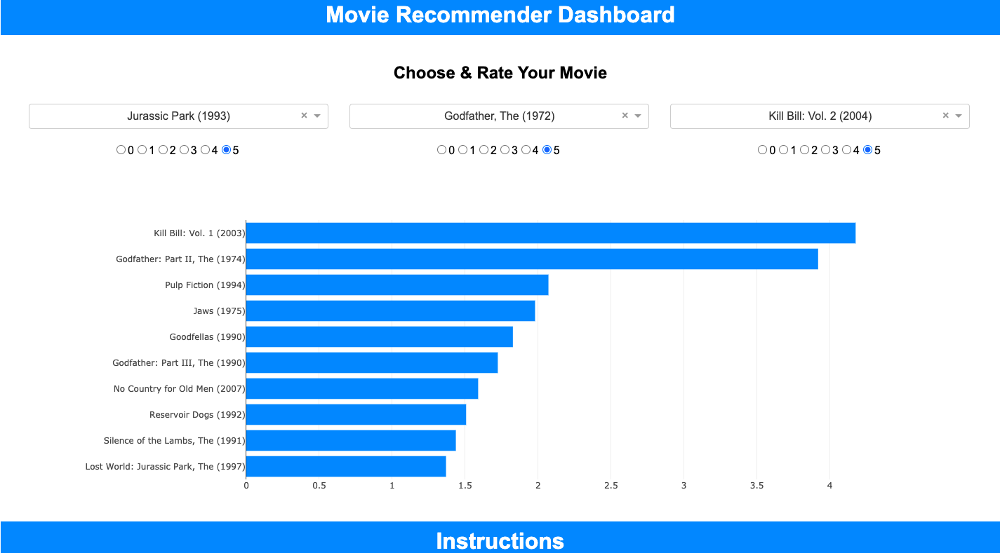
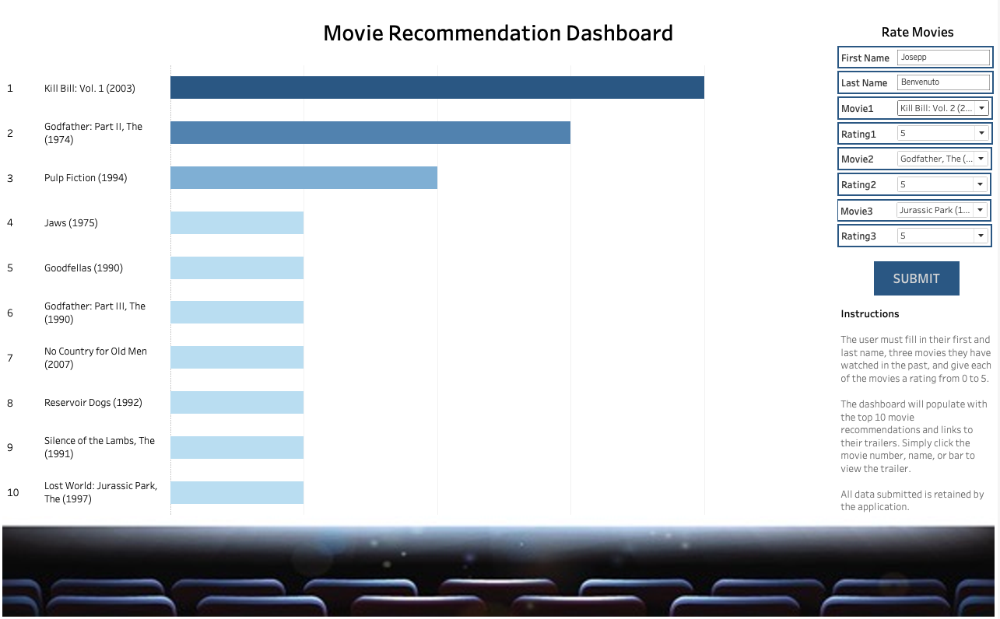

# Movie Recommendation Engine

The analysis explored the movie data set from datalens.com (url: https://grouplens.org/datasets/movielens/) where the data consisted of user ratings from January 09, 1995 and March 31, 2015.

A recommendation engine was created using singular value decomposition (SVD) to create representative latent features of the movies, and with the latent features, cosine similarity was used to generate predictions given user movie ratings.

Having completed the above, a recommendation dashboard app using plotly and dash was created and deployed to Heroku https://movie-dash-app.herokuapp.com/ (**Username**: data, **Password:** analyst, **Note**: the app takes a few seconds to load). The dashboard allows the user to rate three movies to receive top 10 movie recommendations.

In addition to the plotly and dash recommendation dashboard mentioned above, a second dashboard was created using the same recommendation engine in Tableau. The Tableau version consists of different features where the recommendations can be clicked by the user and directed to the movie trailer via YouTube. The user's data all gets retained in google sheets for future analysis. Because Tableau Online and/or Server is needed to deploy this app, the app can only run locally.

The movie recommendation app will appeal to movie enthusiasts and/or anyone looking for movie recommendations.

## Methods Used

1) Descriptive Statistics - used for preliminary data exploration.
2) Singular Value Decomposition (SVD) - used to create a movie recommendation engine.
3) Cosine Distances - used to measure similarities between latent features of restaurants.

## Results

### Descriptive stats after cleaning and data preprocessing

* **Number of movies** - 462
* **Number of users** - 1,894
* **Number of ratings** - 607,734
* **Review dates** - 1995 - 2015 

### SVD Test Results

* **RMSE**: 0.75
* **MAE**: 0.57

## Dashboards

**Plotly & Dash Dashboard**:

**Username**: data
**Password:** analyst
**Note** -  the app takes a few seconds to load

* Deployed to Heroku here: https://movie-dash-app.herokuapp.com/

**Tableau Dashboard**:

## Technologies 

1) Python 
2) Jupyter Notebook
3) Anaconda Environment
4) Pyspark
5) Tabpy server 
6) Tableau

## Order of Analysis

1) **Movie_SVD_Recommendation_Engine.ipynb**
2) **Plotly_Dash_Movie_Recommendation_Dashboard_APP.ipynb**
3) **Movie_Recommendation.twb**

## Directory Files

1) **Data_Preprocessing.ipynb** - Cleaning and preprocessing large data using pyspark.
2) **Movie_SVD_Recommendation_Engine.ipynb** - SVD model creation.
3) **Tableau_Movie_Recommendation_Functions.ipynb** - Recommendations functions created and exported to tabpy server to be used in Tableau.
4) **Plotly_Dash_Movie_Recommendation_Dashboard_APP.ipynb** - Plotly and Dash recommendation dashboard.
5) **Movie_Recommendation_Dash.twb** - Tableau recommendation dashboard.
6) **SVD_Model.pkl** - SVD Model.

