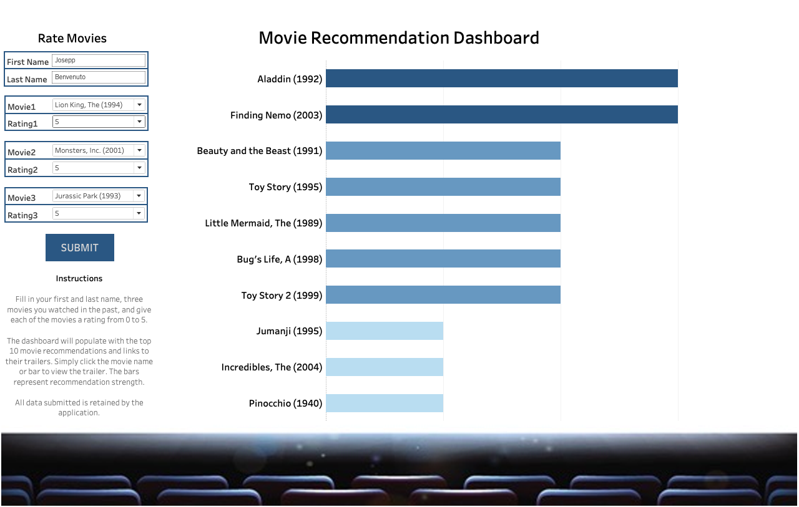

# Movie_Recommendation_Engine

The analysis explored the movie data from datalens (url: https://grouplens.org/datasets/movielens/).

Filtering for only restaurants and culinary businesses in Toronto, topic modeling was used to cluster data and mine for service-standard reviews. Once the clusters had been generated, two recommendations were created using singular value decomposition (SVD) to create representative latent features of the restaurants, and with the latent features, cosine similarity was used to generate predictions given user restaurant inputs and ratings.

The two recommendation engines can be defined as the following:

Recommendation engine for all-standard based reviews and ratings (service and food)
   * all-standard topic model clusters included
Recommendation engine for food-standard based reviews and ratings
   * service-standard topic model clusters reviews not included
Note - The analysis assumed the star ratings were due to the context of the review. For example, if the content of the review was about food and received a five-star rating, the high rating, for the most part, would be due to the quality of the restaurant's food.

Having completed the above, a recommendation dashboard app using plotly and dash was created and deployed to Heroku https://food-dash-app.herokuapp.com/ (Username: data, Password: analyst, Note - the dashboard takes a few seconds to load and is optomized for a 13-inch desktop). The dashboard allows the user to have the choice if he/she wants to be recommended restaurants basis all-standards or simply basis food-standards. The recommendation dashboard app returns 10 recommendations.

Anyone looking to explore and get a deeper look into Toronto's restaurants can use this app.

Methods Used
Descriptive Statistics - used for preliminary data exploration.
Topic Modeling - Used to cluster reviews by their context.
Singular Value Decomposition (SVD) - used to create 2 restaurant recommendation engines basis all standards or food standards.
Cosine Distances - used to measure similarities between latent features of restaurants.
Results

## Dashboards

**Plotly & Dash Dashboard**:

**Tableau Dashboard**:

